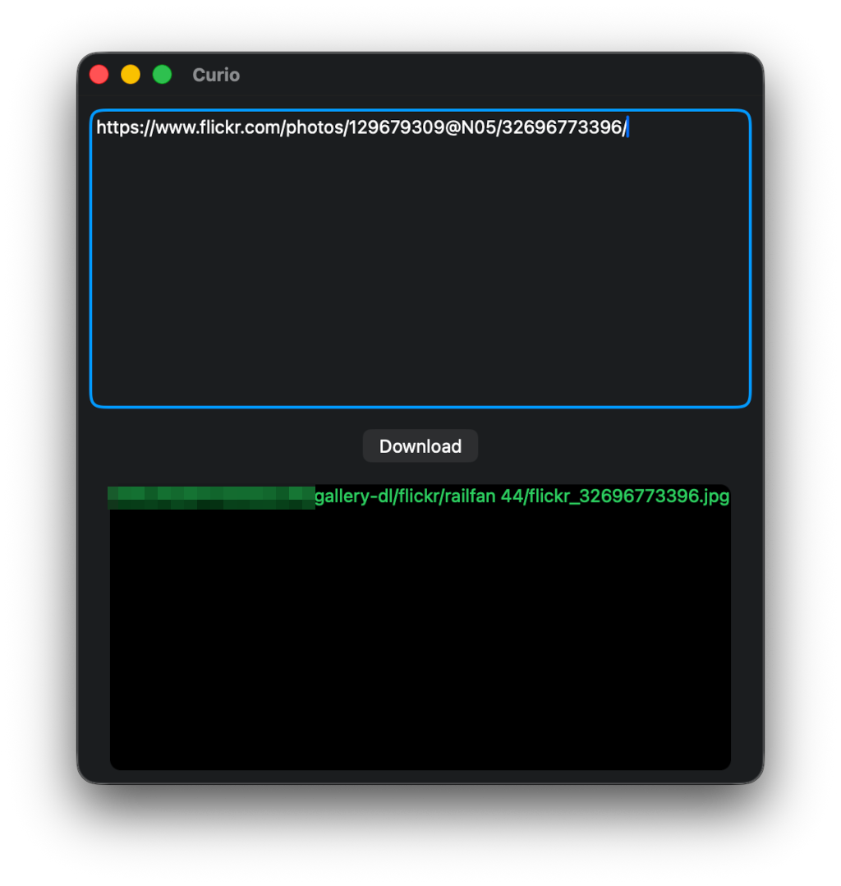

# 🖼️ Curio

<p align="center">
    
</p>

This is a simple gallery-dl GUI for macOS, Windows, and Linux made using [SwiftCrossUI](https://github.com/moreSwift/swift-cross-ui).

## 🖥️ Supported Platforms

| Platform | Minimum Version |
| --- | --- |
| macOS | 13+ |
| Linux | gtk 3+ |

## 🔨 Setup

### Prerequisites

You will need Swift Bundler to properly run and bundle your app.

1. ``brew install mint``
2. ``mint install stackotter/swift-bundler@main``

### Running

```
swift-bundle run
```

### Bundling

```
swift-bundle bundle -c Release
```

## ⚖️ License

I license this project under the GPL-3.0 license - see [LICENSE](LICENSE) for details.
